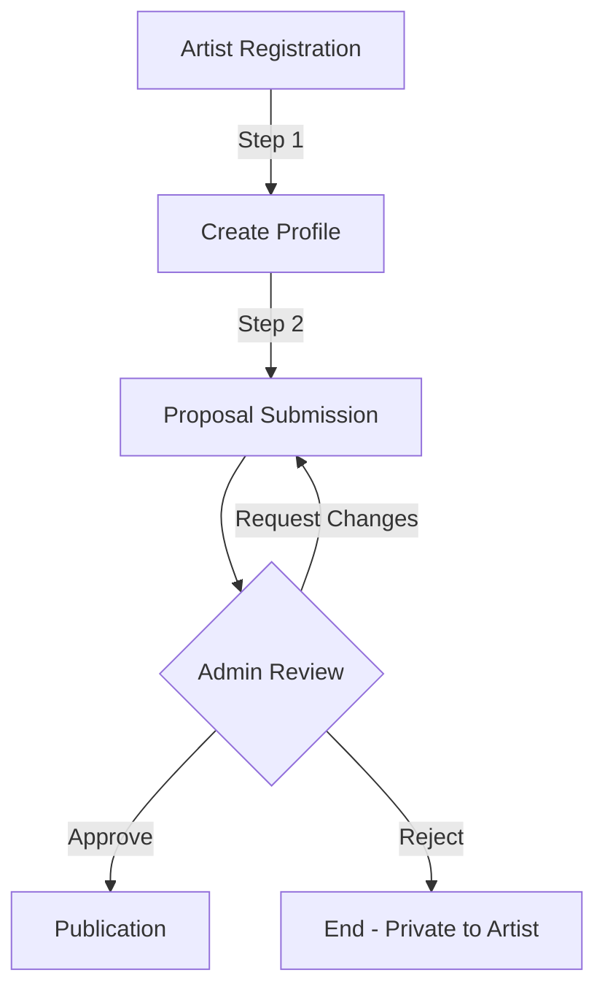
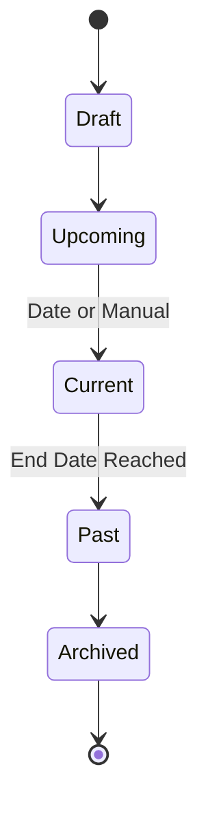

# Studio 201

**Curated Exhibition Platform – System Flow Overview**

---

## 1. What Is Studio 201?

Studio 201 is a curated art gallery website focused on exhibitions.

The primary objective of the platform is to:

- Highlight current exhibitions
- Present upcoming shows
- Archive past exhibitions
- Showcase artists
- Allow artists to submit proposals for review
- Maintain a curated approval model

> **Note:** This is not an e-commerce platform. No online transactions occur. All artwork sales are handled physically at the gallery. The website functions as a digital extension of the physical gallery.

---

## 2. System Philosophy

Studio 201 follows three core principles:

1. **Exhibition-first design**
2. **Curated approval workflow**
3. **Minimal and institutional aesthetic**

Everything in the system supports those principles.

---

## 3. Role Overview

The system includes three roles:

### 3.1 Public Visitor

- No account required
- Can browse exhibitions
- Can view artist profiles
- Can explore archive
- Can view gallery information

### 3.2 Artist

- Registered account required
- Can create and edit profile
- Can submit exhibition proposals
- Can upload portfolio images
- Can track submission status

### 3.3 Admin (Curator)

- Full content control
- Approves or rejects submissions
- Publishes exhibitions
- Manages artists
- Controls homepage content

---

## 4. Public Website Flow

### 4.1 Homepage

**Primary Focus:**

- Current Exhibition (Hero Section)

**Secondary Sections:**

- Upcoming Exhibitions
- Featured Artists
- Archive Preview
- Visit the Gallery

> **Flow intention:** The homepage should immediately communicate what is currently on view.

### 4.2 Exhibition Detail Page

Each exhibition contains:

- Title
- Description
- Dates
- Featured artists
- Gallery images

**Status Types:**

- Current
- Upcoming
- Past

**Navigation:**
Users can navigate to artist profiles directly from the exhibition page.

### 4.3 Artist Profile Page

Each artist page includes:

- Biography
- Artist statement
- Portfolio
- Participated exhibitions

> Artists are linked to exhibitions and vice versa.

### 4.4 Archive

Users can:

- Filter by year
- Browse past exhibitions
- Explore historical records

> The archive builds institutional credibility.

---

## 5. Artist Submission Flow

This is the core internal workflow.

### Step 1: Artist Registration

- Artist creates account
- Profile is created

### Step 2: Proposal Submission

Artist submits:

- Exhibition title
- Description
- Proposed dates
- Images
- Participating artists
- **Submission status defaults to:** `Pending`

### Step 3: Admin Review

Admin can:

- Approve
- Reject
- Request changes

### Step 4: Publication

If approved:

1. Exhibition becomes draft
2. Admin finalizes details
3. Admin publishes exhibition
4. Status changes to `Upcoming` or `Current`

> Rejected submissions remain private to the artist.

---

## 6. Admin Flow

### Admin Dashboard Modules:

- Exhibition Management
- Artist Management
- Submission Review
- Media Library
- Homepage Content Control

> Admin has full editorial authority.

---

## 7. Exhibition Lifecycle

Only Admin can change lifecycle states.

**Lifecycle:**
`Draft` → `Upcoming` → `Current` → `Past` → `Archived`

---

## 8. Content Relationships

The system relationships are:

- Artist ↔ Exhibition
- Exhibition ↔ Images
- Artist ↔ Portfolio
- Artist ↔ Submissions

> This creates a connected cultural archive rather than isolated pages.

---

## 9. Future Expansion (Optional)

Planned enhancements may include:

- RSVP system
- Newsletter subscription
- Virtual exhibition view
- Artist analytics
- Multi-language support

_These are not part of the MVP._

---

## 10. Summary of Flow

**Public User:**
`Homepage` → `Exhibition` → `Artist` → `Archive`

**Artist:**
`Register` → `Create Profile` → `Submit Proposal` → `Await Review`

**Admin:**
`Review Submission` → `Approve` → `Publish Exhibition` → `Maintain Archive`

---

## 11. Design Direction

**Visual identity:**

- Exhibition-first layout
- Full-bleed hero artwork
- Minimal interface
- Serif typography
- Quiet, institutional tone

> The digital presence should reflect the seriousness of the physical gallery.
